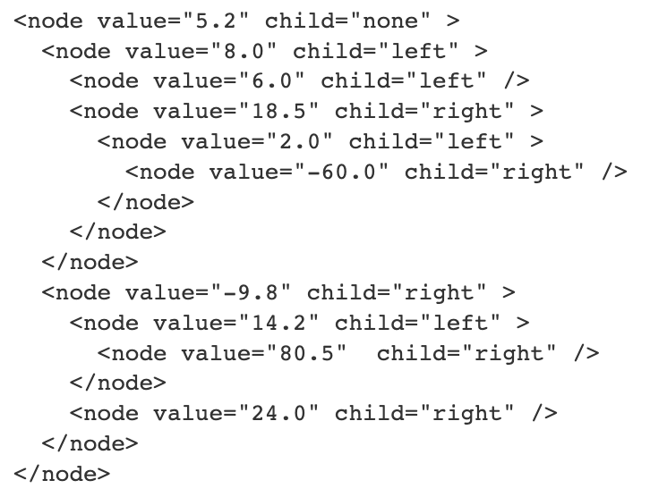
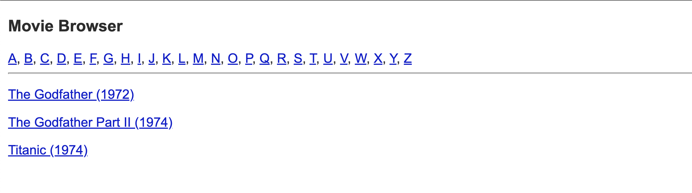
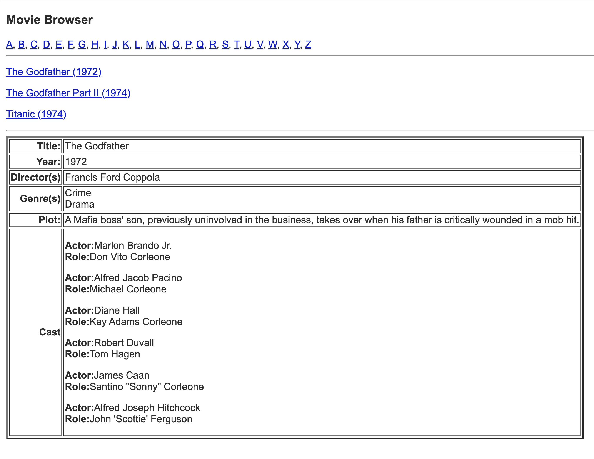

 CSc 8711 Databases and the Web - Spring 2023

### CSc 8711, Spring 2019, Project 2

#### XML Schema, XQuery, and XSLT

**Due**: Wednesday, 15 February 2023

This is an "Individual" project. No collaboration allowed.

#### XML Schema

**(I) Gradebook**

Consider the XML document [gradebook.xml](https://tinman.cs.gsu.edu/~raj/8711/sp23/p2/gradebook.xml). This document describes grade book data as kept by instructors of courses in a university. Here are some constraints in the data:

*   cno data starts with 3 lower-case letters followed by 3 digits.
*   sid values are 4 digit numbers.
*   minit value is a single upper-case letter.
*   cid values begin with a lower case letters "f", "sp" or "su" followed by a 2-digit number followed by a hyphen (-) followed by a 1- or 2-digit number.
*   term values begin with a lower case letters "f", "sp" or "su" followed by a 2-digit number.
*   lineno is a 4-digit number.
*   a, b, c, and d values are between 0 and 100.
*   maxpoints can be a number between 1 and 1000.
*   weight is a number between 1 and 100.
*   score value is a number between 1 and 1000.

Write an XML Schema for the gradebook XML documents. Submit the schema under the file gradebook.xsd.

**(II) Binary Tree**

Consider a sample binary-tree XML document, storing a set of decimal values, given below:

Write an XML Schema for such XML documents. Submit the schema under the file btree.xsd.

#### XQuery

**(I) Drinks**

Consider the XML document [drinks.xml](https://tinman.cs.gsu.edu/~raj/8711/sp23/p2/drinks.xml) which records data about bars, beers, and drinkers in a local neighborhood. Write XQuery expressions to answer the following queries (place the queries in files da.xq, db.xq, ..., de.xq):

1.  Find bars that serve a beer that Donald likes.
2.  Find drinkers who frequent at least one bar that serves a beer they like.
3.  Find drinkers who frequent at least all those bars that Donald frequents.
4.  Find drinkers who frequent no bar that serves a beer they like.
5.  Find drinkers who frequent only bars that serve at least one beer they like.

**(II) Movies**

Consider the XML document [movies.xml](https://tinman.cs.gsu.edu/~raj/8711/sp23/p2/movies.xml) related to a movies database. Write XQuery expressions to answer the following queries (place the queries in files ma.xq, mb.xq, ..., mg.xq):

1.  Get the title and years of movies in the Crime genre.
2.  Get names of persons who have acted in a movie and have directed it as well.
3.  Get titles and years of movies in which James Caan has acted.
4.  Get the names of performers and the number of movies in which they have acted.
5.  Get the names of performers who have acted in at least 10 movies and have directed at least 2 movies.
6.  Get the name(s) of the youngest performer(s).
7.  Get the names of performers who have directed some actor who is older than them.

#### XSLT

**(I) Movies**

Consider the XML document [movies.xml](https://tinman.cs.gsu.edu/~raj/8711/sp23/p2/movies.xml). Write XSLT programs to display a Web page to browse all movies based on the first letter of the movie title. The top of the Web page should have the letters of the alphabet A through Z hyperlinked. On clicking the hyperlink for a letter the lower part of the screen should display movies whose titles begin with that letter. Each of the movies in the listing should display the full title with the year in parentheses. They should also be sorted by year in descending order. The title of the movie should be hyperlinked and upon clicking the hyperlink the details of the individual movie should be displayed below the list of movies. Sample screenshots are shown below:

