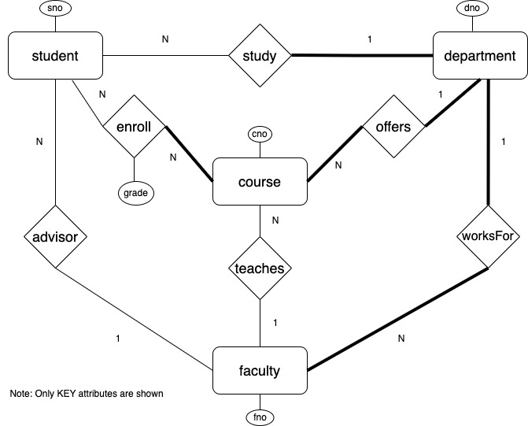

 CSc 8711 Databases and the Web - Spring 2023 - Programming Project 3

Csc 8711, Databases and the Web - Programming Project 3
=======================================================

#### Individual Assignment

**Due**: Wednesday, March 8, 2023

### ER Model in JSON

This assignment deals with JSON representations of a database viewed at from the Entity Relationship data model perspective. As an example, consider the following ER Design of a database:

The following two JSON files represent the ER schema and the instance respectively.

*   [StudentDBSchema.json](https://tinman.cs.gsu.edu/~raj/8711/sp23/p3/files/StudentDBSchema.json)
*   [StudentDBInstance.json](https://tinman.cs.gsu.edu/~raj/8711/sp23/p3/files/StudentDBInstance.json)

This project should work with any ER Database Schema and Instance files coded in JSON.

### Part I: JSON Schema for Schema Files

Design a JSON Schema (ModelSchema.json) for database schema files such as StudentDBSchema.json. Here are some constraints to be imposed:

*   The individual object structures must strictly conform to the keys; i.e., no additional keys or no fewer keys should be allowed.
*   The schema should restrict cardinalities to be one of "one" or "many" and the participation to be one of "mandatory" or "optional".
*   Database, entity, relationship, and attribute names must begin with a letter and may include letters, digits, and underscore characters.

### Part II: Python program to Generate JSON Schema for Instance Files

Write a Python program (GenerateInstanceSchema.py) that takes as command line argument the name of a database schema file, such as StudentDBModel.json, and outputs to the terminal a JSON Schema file for the database instance files corresponding to the input ER schema. As before, the output schema should strictly enforce the object structures with no additional keys or no fewer keys.

### Part III: Validate Instance Files

Write a Python program (Validate.py) to validate an database instance file against the database schema file and the generated instance schema file for both "semantic" as well as "syntactic" errors. The program should first validate the instance file with the generated schema file from previous part for conformity. Then, semantic errors should be caught. The semantic errors in the database schema file are listed below:

*   Duplicate entity name
*   Duplicate attribute in entity/relationship definition
*   Duplicate attribute in primary key
*   Key attribute not in entity definition
*   Duplicate relationship name
*   Entity in relationship not defined

The semantic errors in the database instance file are listed below:

*   Data type error in entity or relationship instance
*   Primary key in entity error
*   Cardinality error in relationship error
*   Participation error in relationship error
*   Invalid attributes in relationship

### Part IV: Generate Relational Design

Write a Python program (GenerateRelationalDesign.py) that takes as command line argument the name of a database schema file, such as StudentDBModel.json, and outputs to the terminal a series of MySQL CREATE TABLE statements that corresponds to the ER Schema using the standard ER-to-Relational mapping.

### What to Submit?

1.  All code to develop the project in files: ModelSchema.json, GenerateInstanceSchema.py, Validate.py GenerateRelationalDesign.py
2.  README file